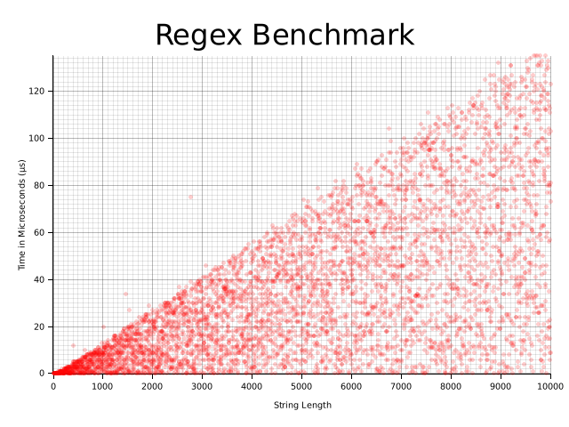
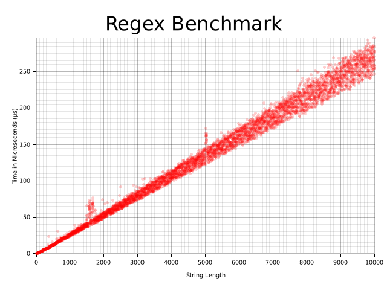

# Regex Speed


## Description
A utility to help visualise the performance of different regular expressions and how they scale with input size.

Typically, in software development we use Big O notation to describe performance. This is typically someone developers learn when first learning to code and is a great way to get a rough idea of how a program will scale with input size. However, this isn't always easy to do with regular expressions. For the mast majority, regular expressions feel like a black box that either works or doesn't. This tool aims to help visualise the performance of regular expressions and how they scale with input size.


## Examples

Let's suppose I want to test the performance of the following three request expressions:

1. `=`
2. `.*(=).*`
3. `.?(=).*`

All of these expressions are valid, and they all do the same thing. In this example, it's easy to see that the first expression is the most efficient. However, in more complex expressions, it's not always easy to see which expression is the most efficient. This is where `regex-speed` comes in.

We'll run test each of the regex expressions defining the following options:

* `--max-length 100000` - The max string length to test will be 100,000.
* `--step-size 10` - The step size will be 10, meaning the string length will increase by 10 each iteration.
* `--num-tests 5` - We will run each test 5 times plotting each result onto the graph.
* `--required-str x=xxxxxxxxxxxxxx` - The random strings that are generated will have the string `x=xxxxxxxxxxxxxx` somewhere in them.
* `--method find` - We want to actually locate the "=" in the string. This isn't at all useful in a real life example, but it's a nice way to demonstrate the performance of the regex expressions.

Let's run the tests:

```bash
regex-speed \
  --regex '=' \
  --max-length 100000 \
  --step-size 10 \
  --num-tests 5 \
  --required-str x=xxxxxxxxxxxxxx \
  --method find
```



```bash
regex-speed \
  --regex '.*(=).*' \
  --max-length 100000 \
  --step-size 10 \
  --num-tests 5 \
  --required-str x=xxxxxxxxxxxxxx \
  --method find
```


```bash
regex-speed \
  --regex '.?(=).*' \
  --max-length 100000 \
  --step-size 10 \
  --num-tests 5 \
  --required-str x=xxxxxxxxxxxxxx \
  --method find
```



Although all three expressions are valid and we can retrieve the "=" from the results, we can see that the performance of each expression is very different.

The first expression is the most efficient. Although we do have a couple of outliers, the performance is very consistent giving us a good indication that the result is constant time.

The second expression is the least efficient. We can see a linear growth with a increase of spread as the input size increases. **This might look like a time complexity of O(n), however this isn't actually true. The time complexity is actually O(n^3) in terms of how many steps actually need to be executed. This graph instead represents the actual time to perform the regex search**.

The final expression is the most interesting. We can see that it is slower than the first expression, but faster than the second. The biggest difference is that the spread is absolutely massive!

## Usage

### Installation

### Linux

1. Download the latest `regex-speed` binary from [releases page](https://github.com/Salaah01/regex-benchmark/releases).
2. Ubuntu users will need to install additional dependencies:
    ```bash
    sudo apt install pkg-config libfreetype6-dev libfontconfig1-dev
    ```
3. Run the binary in the terminal with the `--help` flag to see the available options:
    ```bash
    ./regex-speed --help
    ```

### Windows

1. Download the latest `regex-speed.exe` binary from [releases page](https://github.com/Salaah01/regex-benchmark/releases).
2. Run the binary in Powershell/CMD with the `--help` flag to see the available options:
    ```powershell
    .\regex-speed.exe --help
    ```
